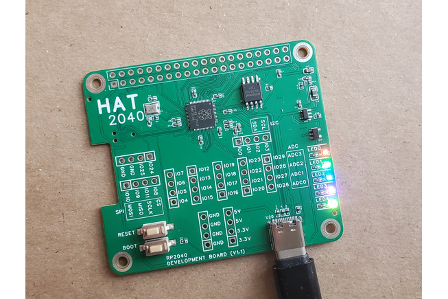
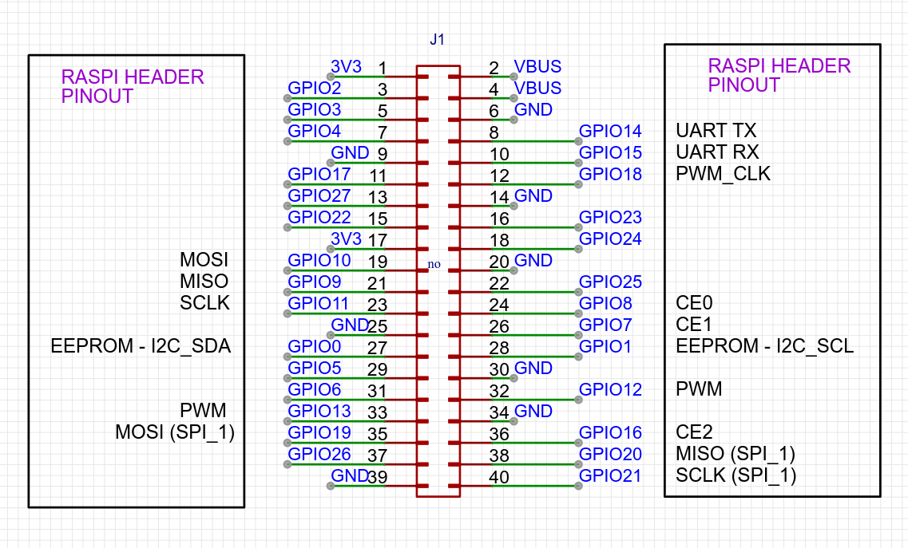

# rp2040-HAT (16 MB)

Easy to use rp2040 development board.

# header pinout

# Pinout
All of the gpio pins are broken out on the front of the board.

*all gpio pins on the rp2040 are available*

# 16MB
There is 16 megabytes of storage included on this board. The Pico only has 2 megabytes.

# using with Raspberry Pi
In order to upload code from the raspberry pi you will need to solder the solder-jumpers on the back of the board.

There are 4 solder jumpers on the back, these allow SWD + UART communication directly between the rp2040 and the raspberry pi host system.

# Micropython

  You can use Thonny and Micropython to easily program this device.

  In micropython, in order to get all 16MB of storage you will need to use a custom UF2 image file.
  If we use the standard file for pico, only 2MB is available.
  The easiest is to use the pimoroni-pico release for pimoroni-picolipo_16mb

  The rp2040-HAT is compatible with the picolipo image file

  Here is the download link to a recent version of the UF2
  https://github.com/pimoroni/pimoroni-pico/releases/download/v1.20.2/pimoroni-picolipo_16mb-v1.20.2-micropython.uf2

  You can get the most recent version by visiting their release page
  https://github.com/pimoroni/pimoroni-pico/releases

  After you copy the UF2 to the rp2040-HAT device, you will be able to connect to the board using Thonny.

  See the micropython folder for example code.

# OpenOCD from Raspberry Pi
see the install_sdk.sh, bash script

If you run that script on the raspberry pi, will setup the pi to allow SWD programming via OpenOCD

You can also manual step thru the commands, just open the file and copy-n-paste the lines manually into your raspberry pi terminal.

# OpenOCD from a Desktop (remote)
You can also start OpenOCD on the PI in remote mode (esp. debugging)

This will allow you to debug the rp2040 from the PI, remotely on your desktop pc (in vccode for example)

# example code
This board is 100% compatible with all raspberry pi pico examples.
See https://github.com/raspberrypi/pico-examples

# UF2 not booting correctly?
If you run into issues using UF2 files via usb, and the device not booting correctly.
There is a timing issue with the rp2040 not booting at times using UF2 files, but the fix is simple.

Add the following line to your CMakeLists.txt file

> add_compile_definitions(PICO_XOSC_STARTUP_DELAY_MULTIPLIER=64)

This will add a small delay to startup to allow booting properly.

This problem doesn't seem to affect SWD uploaded ELF files. So the added flag should not be needed when using SWD.

for more info see:
https://github.com/raspberrypi/pico-sdk/pull/457
https://github.com/raspberrypi/pico-sdk/pull/401

# more examples
there will be more examples available
One neat example code allows using the rp2040-pHAT as an SPI Slave to the raspberry pi board.
